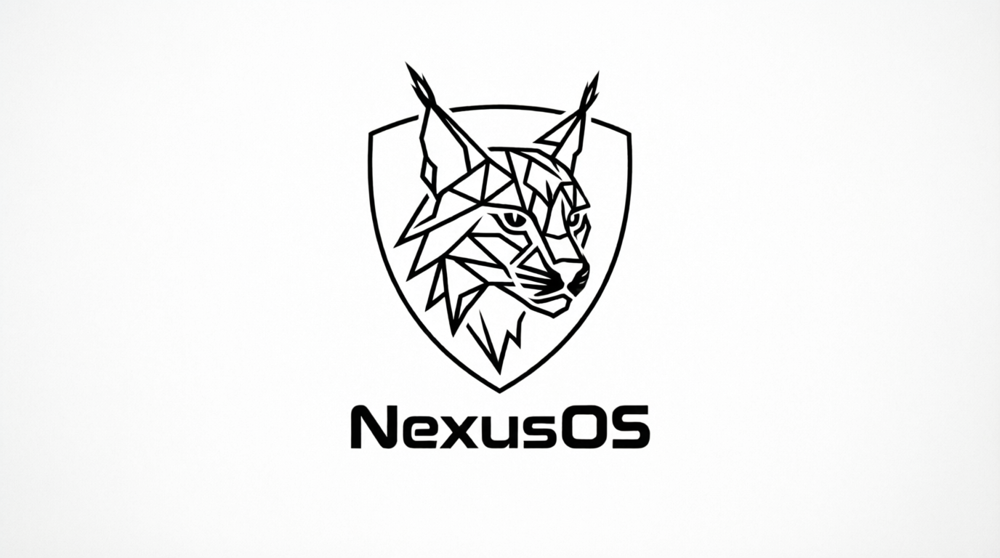

# NexusOS

A tiny operating system for i386, written from scratch: bootloader, kernel,
drivers, filesystem, multitasking, network stack and a built-in BASIC.
No libc, no existing kernel, no copy-paste frameworks. Just C, x86 assembly and QEMU.

Every stage was debugged by hand on real interrupts, page faults and panic dumps.
See the changelog below.

## Highlights

- Custom MBR bootloader, 32-bit protected mode (GDT, IDT, PIC, PIT, RTC)
- Paging (4 MB pages) + physical memory manager + kmalloc heap
- Preemptive round-robin multitasking (ps / spawn / kill)
- Hierarchical filesystem with directories, persisted to disk via ATA PIO
- ELF loader + int 0x80 syscalls for user programs
- Network stack from scratch: PCI, e1000 MMIO, Ethernet, ARP, IPv4, ICMP (ping works)
- VGA text UI, PS/2 keyboard and mouse, PC speaker, text editor
- NexusBASIC: a built-in interpreter (LET / PRINT / IF..THEN..ELSE / GOTO / LIST)
- Red-screen panic handler with register dump (it actually helps debug)

## Build and run (Windows)

Requirements: LLVM/Clang (clang, ld.lld, llvm-objcopy) and QEMU on PATH.

    build.bat

Then flash the image and launch QEMU. Inside the emulator type help.

## Shell commands

    help ver date uptime sleep N clear echo reboot
    mem ptest malloc N ps spawn X kill N panic
    ls [-l] cat F touch F rm F write F T edit F sync
    mkdir D cd D pwd beep [f] mouse tz N run S
    net ping A.B.C.D wc grep P basic [file.bas]
    cmd > file   cmd < file   cmd1 | cmd2

## Development log

Stage 1: MBR + protected mode
Stage 2: GDT / IDT / ISR / IRQ
Stage 3: Keyboard + NexusShell
Stage 4: PIT + RTC (date, sleep)
Stage 5: Paging + PMM + kmalloc
Stage 6: Filesystem + mouse + sound + editor
Stage 7: Multitasking (ps / spawn / kill)
Stage 8: ATA PIO + persistence + panic screen
Stage 9: ELF loader + syscalls
Stage 10: Network: e1000 + ARP / IPv4 / ICMP
Stage 11: Hierarchical FS + NexusBASIC + pipes and redirection + persistent history

## License

MIT - see LICENSE.
